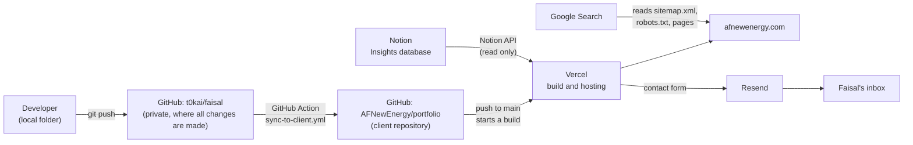

# Abdullah Bin Hossain (Faisal) · AF New Energy website

The website of Abdullah Bin Hossain (Faisal), power project developer in Bangladesh, and his company **AF New Energy**.

**Live site:** https://afnewenergy.com

| | |
|---|---|
| Framework | Next.js 15.5 (App Router) · React 19 · TypeScript · Tailwind CSS v4 |
| Languages | English, Chinese, Arabic (right to left), Turkish, German, French, with `next-intl` |
| Hosting | Vercel |
| Articles (Insights) | Written in Notion, shown on the site automatically |
| Everything else | Typed files in this repository |
| Contact form | Sends email through Resend |
| Design system | "Meridian", see [DESIGN.md](./DESIGN.md) |
| Last reviewed | 26 September 2026 |

Other guides in this repository:

- [NOTION-SETUP.md](./NOTION-SETUP.md): connecting Notion, writing and publishing articles, how each Notion block is shown
- [DEPLOY.md](./DEPLOY.md): first deployment, custom domain, build troubleshooting
- [DESIGN.md](./DESIGN.md): colours, type, components and how to re-skin the site

---

## Contents

1. [Upcoming upgrades and recommendations](#1-upcoming-upgrades-and-recommendations)
2. [How the whole system fits together](#2-how-the-whole-system-fits-together)
3. [How a change reaches the live site](#3-how-a-change-reaches-the-live-site)
4. [Where everything is](#4-where-everything-is)
5. [Services and environment variables](#5-services-and-environment-variables)
6. [Editing content](#6-editing-content)
7. [Insights from Notion](#7-insights-from-notion)
8. [Caching and refresh times](#8-caching-and-refresh-times)
9. [SEO](#9-seo)
10. [Security](#10-security)
11. [Limitations](#11-limitations)
12. [Troubleshooting](#12-troubleshooting)
13. [Working on the code](#13-working-on-the-code)
14. [Checks at the last review](#14-checks-at-the-last-review)

---

## 1. Upcoming upgrades and recommendations

### Urgent

| # | What | Why | Deadline |
|---|---|---|---|
| 1 | **Upgrade Next.js 15 to Next.js 16** | Next.js 15 is in "Maintenance LTS" and gets security fixes only until **21 October 2026** ([support policy](https://nextjs.org/support-policy)). After that date, new security holes in 15.x are not patched. | Before 21 Oct 2026 |
| 2 | **Check the Vercel plan** | Vercel's free Hobby plan is for non-commercial personal use only. A site that advertises services, or that someone is paid to build, needs Pro or Enterprise ([fair-use rules](https://vercel.com/docs/limits/fair-use-guidelines)). Hobby also caps image optimisation at 5,000 transformations a month. | Now |

**What the Next.js 16 upgrade involves.** Follow the official upgrade guide and check each point below. Build and test before merging.

- `src/middleware.ts` is renamed to `proxy.ts` in Next.js 16. It holds the language routing from `next-intl`.
- The `next lint` command is removed, so the `lint` script in `package.json` needs replacing or deleting.
- Turbopack becomes the default bundler for `next build`.
- Some image defaults change. Check `next.config.ts`.
- Page `params` are already awaited everywhere (`await params`), which Next.js 16 requires, so no change is needed there.
- Update `next-intl` to a release that lists Next.js 16 support.
- The `overrides` block in `package.json` (postcss and sharp) exists only because Next.js 15 pins old versions. Review it after the upgrade and remove what is no longer needed.

### Recommended soon

| # | What | Why |
|---|---|---|
| 3 | **Remove the two unused image hosts from `next.config.ts`** (`**.amazonaws.com`, `images.unsplash.com`) | Nothing on the site loads from them any more: Notion photos go through the site's own photo relay. Leaving them allows anyone to run images from those hosts through this site's optimiser, which uses up the plan's image quota. |
| 4 | **Add visitor analytics** (Vercel Analytics or GA4) | At the moment there is no way to see traffic, sources or which articles are read. Add a cookie notice if GA4 is used for EU visitors. |
| 5 | **Turn on Dependabot alerts** in both GitHub repositories | Security warnings for dependencies then arrive automatically. |
| 6 | **Write down the expiry date of `CLIENT_REPO_TOKEN`** | The sync Action (section 3) uses a fine-grained GitHub token. When it expires, pushes stop reaching the client repository and nothing deploys. Renew it before it expires. |
| 7 | **Add a build check on every push** | A GitHub Action that runs `npm ci && npm run build` catches a broken commit before it reaches Vercel. |
| 8 | **Delete `src/components/ui/`** | An old copy of Button, Icon and Reveal. Nothing imports it. |
| 9 | **Fix the share-preview image** | `src/app/[locale]/opengraph-image.tsx` still shows `site.stats.capacityGW` ("20 GW+"), the figure the site itself no longer uses. Also, the Arabic and Chinese preview images show empty boxes because the image renderer has no Arabic or Chinese font. Add the fonts to `ImageResponse` to fix it. |

### Routine maintenance

| What | How often |
|---|---|
| Install minor updates (`npm outdated`, then `npm update`), build, test, push | Every 1 to 2 months |
| Run `npm audit` and fix anything high or critical | Monthly, and when Dependabot warns |
| Send a test message through the contact form | Monthly |
| Check Google Search Console for errors and pages that are not indexed | Monthly |
| Review figures in the articles (capacity, tariffs, policies) and update them in Notion | Every 3 to 6 months |
| Export the Notion Insights database as a backup (Notion: ••• → Export) | Every few months |
| Confirm the afnewenergy.com domain is on auto-renew | Once a year |
| Rotate `NOTION_TOKEN` and `REVALIDATE_SECRET` if anyone else has seen them | When needed |

### Content to confirm with Faisal

- **Headline figures** in `src/config/site.ts` → `stats` (years, proposals won, projects, partners).
- **Project stages** in `src/content/local/projects.ts`. Nothing marked Approved or Operational should really be at feasibility.
- **Logos** in `src/config/organisations.ts`. Remove any organisation under an NDA, and delete its two files in `public/logos/`.
- **Article facts and references.** The ten articles were researched from public sources in September 2026 and need a check by Faisal.
- **Nice to have:** a higher-resolution portrait (`public/photos/portrait.jpg` is 762 × 1017) and a wider boardroom photo (`public/photos/boardroom.jpg`).

---

## 2. How the whole system fits together



In words:

1. **Code** lives in GitHub. All changes are made in the private repository `t0kai/faisal`. A GitHub Action copies every push to `main` into the client repository `AFNewEnergy/portfolio`.
2. **Vercel** watches `AFNewEnergy/portfolio`. Every push to `main` builds a new version and puts it live on afnewenergy.com. If a build fails, the previous version stays live.
3. **Articles** live in a Notion database called **Insights**, inside Faisal's **Website** page. The site reads them through a Notion connection called "AF New Energy Website", which has read-only access.
4. **Contact form** messages are sent by the site through Resend to Faisal's email.
5. **Pages** are built in advance and served from Vercel's global cache, then refreshed in the background (section 8). Visitors never wait for Notion.

---

## 3. How a change reaches the live site

### Code or text changes

```bash
# in the local project folder (a clone of t0kai/faisal)
git add -A
git commit -m "Describe the change"
git push
```

Then:

1. GitHub runs **Sync to client repo** (`.github/workflows/sync-to-client.yml`), which pushes the same commit to `AFNewEnergy/portfolio`. Check it under the **Actions** tab of `t0kai/faisal`.
2. Vercel builds it, usually in 2 to 3 minutes. Check it under the project's **Deployments** in Vercel.
3. The change is live when the deployment shows **Ready**.

**Rules**

- Always commit to `t0kai/faisal`, never directly to `AFNewEnergy/portfolio`. If someone commits to the client repository directly, the sync refuses to overwrite it and the Action fails. The push URL of the client remote is disabled in the local folder on purpose.
- The Action needs the secret `CLIENT_REPO_TOKEN` in `t0kai/faisal` → Settings → Secrets and variables → Actions. It is a fine-grained token from the AFNewEnergy account with access to `portfolio` only (Contents and Workflows: read and write).

### Article changes

No push is needed. Edit in Notion and the site follows within about a minute (section 7).

---

## 4. Where everything is

```
.
├─ src/
│  ├─ app/                         pages and server routes (Next.js App Router)
│  │  ├─ [locale]/                 every page, once per language
│  │  │  ├─ layout.tsx             <html>, fonts, header, footer, site-wide JSON-LD, title template
│  │  │  ├─ page.tsx               home
│  │  │  ├─ about/ services/ contact/
│  │  │  ├─ projects/ [slug]/      project register and project pages
│  │  │  ├─ insights/ [slug]/      article list and article page
│  │  │  ├─ not-found.tsx          404
│  │  │  └─ opengraph-image.tsx    share-preview image, generated per language
│  │  ├─ api/
│  │  │  ├─ contact/               contact form → Resend (spam trap + rate limit)
│  │  │  ├─ revalidate/            "refresh now" link (needs REVALIDATE_SECRET)
│  │  │  └─ notion/
│  │  │     ├─ setup/              one-time link that creates the Insights database
│  │  │     ├─ img/                photo relay for photos uploaded to Notion
│  │  │     └─ file/               download links for PDFs and files in Notion
│  │  ├─ feed.xml/                 RSS feed of English articles
│  │  ├─ sitemap.ts  robots.ts     search engine files
│  │  ├─ icon.svg  apple-icon.png  favicon and home-screen icon
│  │  └─ globals.css               every named visual class (components layer)
│  ├─ components/
│  │  ├─ layout/                   Header, Footer, MobileDrawer, LanguageSwitcher, ThemeToggle
│  │  ├─ sections/                 Hero, Figures, Plates, Register, LogoRibbons, Portfolio, Timeline, ContactForm …
│  │  ├─ insights/                 InsightsIndex (grid, list, pages, All) · ArticleParts (contents, share, references)
│  │  ├─ primitives/               Icon, Button, Reveal, Rail, Figure
│  │  ├─ seo/                      JsonLd
│  │  └─ ui/                       unused, see recommendation 8
│  ├─ config/
│  │  ├─ site.ts                   single source of truth: name, company, contact details, stats, photos, languages
│  │  ├─ organisations.ts          logos in the home-page ribbons
│  │  └─ theme.ts                  the few colours non-CSS code needs (share image)
│  ├─ content/
│  │  ├─ index.ts                  picks where content comes from (Notion or local files)
│  │  ├─ types.ts                  Project, Insight and the ContentSource interface
│  │  ├─ local/                    projects.ts (the project register), insights.ts (built-in articles)
│  │  ├─ samples/                  the 10 articles and the writing guide, written as Notion blocks
│  │  └─ notion/                   Notion reader: client, schema, insights, render (blocks → HTML), media, lookup
│  ├─ messages/                    en · zh · ar · tr · de · fr (237 keys each, kept in parity)
│  ├─ styles/tokens.css            every colour, font, radius and spacing value
│  ├─ i18n/                        language routing
│  ├─ lib/                         seo, jsonld, img, format, slug, rate-limit, social
│  └─ middleware.ts                sends / to /en and handles language URLs
├─ public/
│  ├─ photos/                      site photos; photos/insights/ holds the article photos
│  ├─ logos/                       organisation logos (colour and white versions)
│  └─ logo.png                     company logo used in search results
├─ scripts/                        preflight, contrast check, Notion helpers
├─ .github/workflows/              sync-to-client.yml
├─ .env.example                    every environment variable, with notes
└─ next.config.ts                  images, security headers, next-intl plugin
```

### Design rules that keep it maintainable

- **One file per kind of fact.** Contact details, name and company live only in `src/config/site.ts`, so changing one updates the header, footer, contact page, structured data and share image.
- **One file per kind of look.** Visual values live only in `src/styles/tokens.css`. Components use named classes from `globals.css`; Tailwind handles layout only.
- **Content behind an interface.** Pages ask `content()` for projects and articles and never know whether they came from Notion or a local file.
- **SEO in one place.** Every page builds its metadata with `buildMetadata()` in `src/lib/seo.ts`, so canonical links, language alternates and share tags stay consistent.
- **Mostly server-rendered.** Only interactive parts (header menu, theme and language switchers, contact form, article list, article extras, logo ribbons, scroll reveals) ship JavaScript.

---

## 5. Services and environment variables

### Services

| Service | Used for | Account | Where it is set up |
|---|---|---|---|
| GitHub `t0kai/faisal` | Working repository, all changes | Developer | github.com |
| GitHub `AFNewEnergy/portfolio` | Repository Vercel deploys from | AFNewEnergy | github.com |
| Vercel | Build, hosting, domain, environment variables | Project owner | vercel.com → project → Settings |
| Notion | Articles (Insights database inside the Website page) | Abdullah bin Hossain's Space | notion.so; connection "AF New Energy Website" in the Notion Developer portal |
| Resend | Sending contact-form email | Project owner | resend.com (API key + verified sending domain) |
| Domain registrar | afnewenergy.com | Domain owner | the registrar; DNS points at Vercel |
| Google Search Console | Indexing, search performance | Site owner | search.google.com/search-console |

### Environment variables (Vercel → Settings → Environment Variables)

Values are never stored in this repository. `.env.example` lists them with notes. After changing any value in Vercel, **redeploy**, because a change only applies to new deployments.

| Variable | Needed? | What it does |
|---|---|---|
| `NEXT_PUBLIC_SITE_URL` | Recommended | The public address, `https://afnewenergy.com`. Production falls back to this address if it is missing. |
| `NOTION_TOKEN` | For Insights | The connection's API token from the Notion Developer portal. Without it the site shows the built-in articles. |
| `REVALIDATE_SECRET` | For Insights | Long random string (letters and numbers only). Protects the setup link and the refresh link. |
| `NOTION_INSIGHTS_DS` | Optional | The Insights database id. The setup page shows it once the database exists. With it, the site goes straight to the database instead of searching Notion for it. |
| `INSIGHTS_SOURCE` | Optional | `local` forces the built-in articles even with a token, for testing. |
| `RESEND_API_KEY` | For the contact form | Resend API key. |
| `CONTACT_FROM_EMAIL` | For the contact form | Sender address on a domain verified in Resend, for example `website@afnewenergy.com`. |
| `CONTACT_TO_EMAIL` | Optional | Where enquiries go. Defaults to the email in `site.ts`. |
| `CONTENT_SOURCE`, `NOTION_PROJECTS_DS` | Optional | `CONTENT_SOURCE=notion` moves projects to a Notion database too (not used today). |

Vercel may mark values as **Sensitive**, which hides them after saving. A hidden value cannot be read back; to change it, edit the variable, paste a new value and redeploy.

---

## 6. Editing content

| To change | Edit | Push needed? |
|---|---|---|
| An article (text, photos, references) | The page in Notion → Insights | No |
| Publish or hide an article | Tick or untick **Published** in Notion | No |
| Name, company, email, phone, WhatsApp, social links, headline figures, photos | `src/config/site.ts` | Yes |
| Page text and labels in all six languages | `src/messages/<language>.json` (keep the same keys in every file) | Yes |
| Project register and project pages | `src/content/local/projects.ts` | Yes |
| Career timeline (every role and its full CV detail) | `src/content/local/career.ts` | Yes |
| Services (the four capability plates) | `src/components/sections/Plates.tsx` (list) and `capabilities.items` in the message files (text) | Yes |
| Logo ribbons | `src/config/organisations.ts` and `public/logos/` | Yes |
| Colours, fonts, spacing | `src/styles/tokens.css`, then run `npm run contrast` | Yes |
| The built-in copies of the articles | `src/content/samples/articles.ts` (used only when Notion is not connected) | Yes |

**Writing style used across the site:** no em dashes in page text, titles or articles. Use commas, colons or full stops instead; en dashes are kept only for ranges such as "2020 – 2023".

---

## 7. Insights from Notion

Full guide: [NOTION-SETUP.md](./NOTION-SETUP.md). In short:

**Publishing.** In Notion, open **Website → Insights**, click **New** (or duplicate the "✍️ Writing guide" page), fill in Title and Subtitle, write, then tick **Published**. The article appears on the site within about a minute. For "show it now", open:

```
https://afnewenergy.com/api/revalidate?secret=YOUR_SECRET
https://afnewenergy.com/api/revalidate?secret=YOUR_SECRET&path=/en/insights   (one page only)
```

**What the site builds from a Notion page**

- Numbered sections from the headings, with a table of contents that follows the reader.
- Reading time, published and updated dates, author card and share buttons (copy link, LinkedIn, WhatsApp, X).
- Photos: "Wide:" or "Small:" at the start of a caption sets the size; text after " | " becomes the photo credit. Photos placed side by side in columns become a gallery.
- Numbered citations like `[3]`, linked to a **References** list at the end, with a "Cite" tab.
- Tables, callout boxes, pull quotes (put "- Name" on the last line), numbered steps, videos (YouTube and Vimeo load only on click), bookmarks and file downloads.
- A **Read on Notion** button when the Notion page is published to the web.

**Columns in the database:** Title, Subtitle, Published, Date, Topic, Tags, Type (Article or Video), Video URL, Video minutes, Cover caption, Slug, Language. `NOTION-SETUP.md` explains each one.

**Translations.** Articles are written once, in English. To add a Chinese (or other) version, create a second row with the **same Slug** and set **Language** (for example `zh`). Visitors on that language see the translation; everyone else sees English. Pages showing an untranslated article on another language's site point search engines at the English original, so they do not count as duplicates.

**Photos uploaded into Notion.** Notion's file links expire after about an hour, so the site serves them through its own relay (`/api/notion/img/...`). The relay asks Notion for a fresh link, resizes the photo to the width the browser needs (480 to 2400 px), converts it to WebP (JPEG for share previews) and caches it for a year. Replacing a photo in Notion gives it a new address automatically.

**Setup link.** `https://afnewenergy.com/api/notion/setup?secret=YOUR_SECRET` shows the status. It only changes something when a button on that page is pressed:

- **Create the Insights database** (first time) and **Put back sample articles** need the connection's **Insert content** capability.
- **Replace photos** appears when a sample article in Notion still shows a photo of Faisal (the first copies of the samples did). It swaps each one for the power-sector photo in the same place in the current sample, with a new caption, and leaves photos Faisal added himself alone. It needs **Update content**.

Both capabilities are switched off after setup; tick the one needed, press the button, then untick it.

**Photos inside articles** are power-sector and solar photos only (`public/photos/insights/`). Photos of Faisal are kept for the site's own pages and the author card; `PERSONAL_PHOTOS` in `src/content/samples/articles.ts` lists them.

**The connection has read-only access** ("Read content" only, no user information). Faisal edits in Notion as normal; the limit applies only to the website.

**When Notion is unavailable**

- While the site is running: visitors keep getting the last good version of every page; new edits appear once Notion answers again.
- During a deploy: if Notion cannot be read, the build stops on purpose and the previous version stays live. Before an Insights database exists, a build uses the built-in articles instead.
- The refresh link checks Notion first and refuses to clear the cache if Notion is down (answer 503) or the database cannot be found (answer 409).

---

## 8. Caching and refresh times

| What | Refreshed |
|---|---|
| Home, Insights list, articles | Every minute (in the background, when visited) |
| Projects | Every 5 minutes |
| About, services, contact | Every hour |
| `sitemap.xml`, `feed.xml` | Every hour |
| Photos from Notion (relay) | Cached for a year per version |
| Everything | Immediately with the refresh link, or on each deploy |

---

## 9. SEO

Already in place:

- A title, description and canonical link on every page. Titles end with "| AF New Energy"; the home page title leads with Faisal's name.
- Language alternates (`hreflang`) for all six languages plus `x-default`. Articles list only the languages they are really written in.
- `sitemap.xml` with every page, real article dates and article images; `robots.txt` that blocks `/api/` except the photo relay, and blocks everything on preview deployments.
- An RSS feed at `/feed.xml`.
- Structured data: WebSite, Organization (AF New Energy), Person (with his job title and company), ProfessionalService, BlogPosting or VideoObject for each article, and breadcrumbs.
- Share previews (Open Graph and Twitter cards) with a generated image per language, and the article cover for articles.
- Favicon, home-screen icon and a company logo for search results.
- One `<h1>` per page and headings in order; image alt text; page links as real links (the Insights page numbers included).

**To do once:** submit `https://afnewenergy.com/sitemap.xml` in Google Search Console (and optionally Bing Webmaster Tools).

---

## 10. Security

- **Secrets** (`NOTION_TOKEN`, `REVALIDATE_SECRET`, `RESEND_API_KEY`, GitHub tokens) live only in Vercel and GitHub settings. Never commit them, paste them into chat, or show them in screenshots. If one leaks, create a new one and redeploy.
- **Notion connection:** read-only, no access to user information.
- **Setup and refresh links:** the secret is compared in constant time; after 10 wrong attempts from one address, both links lock for an hour.
- **Photo and file relays:** accept only exact, known address shapes, fetch only files stored in Notion, remember each lookup for 20 minutes, and are rate limited per visitor (120 and 60 requests a minute).
- **Contact form:** hidden spam trap, rate limit per visitor, and all input is escaped in the email.
- **Article HTML:** every piece of text and every link from Notion is escaped; links are limited to http, https, mailto and tel.
- **Headers:** `X-Content-Type-Options`, `Referrer-Policy`, `X-Frame-Options` and `Permissions-Policy` on every response.
- **Dependencies:** `npm audit` reported 0 vulnerabilities at the last review. The `overrides` block in `package.json` pulls patched postcss and sharp that Next.js 15 would otherwise pin to older versions; sharp's override is written `"$sharp"` because sharp is also a direct dependency (npm refuses two different version specs for the same package).
- The rate limits are kept in memory on each server instance. That stops casual abuse but not a large distributed attack; Vercel's firewall is the next step if that is ever needed.

---

## 11. Limitations

- **Only articles are editable without code.** About, services, projects, the timeline and the headline figures need a code change and a push.
- **Articles are English unless a translated copy is added** in Notion. Page text and menus are in all six languages.
- **No analytics** until recommendation 4 is done.
- **Changes in Notion take about a minute** to appear (or use the refresh link). The first visit after that minute starts the refresh, so reload once if the old version still shows.
- **Notion rate limits** (about 3 requests a second per connection) are fine for this site, but a very large number of articles would make refreshes slower.
- **Spam protection is basic** (spam trap and rate limit). Add a captcha if spam becomes a problem.
- **Tests are not in the repository.** Changes are checked by building (`npm run build`) and by reviewing a Vercel preview deployment.
- **Arabic and Chinese share previews** show empty boxes (recommendation 9).

---

## 12. Troubleshooting

| Symptom | Likely cause | Fix |
|---|---|---|
| Vercel: `npm error code EOVERRIDE` | An `overrides` entry conflicts with a dependency of the same name | Point the override at the dependency: `"sharp": "$sharp"` |
| Vercel build stops with "Could not read insights from Notion" | Notion was unreachable or the token was rejected during the build | Check `NOTION_TOKEN` and that the Website page is shared with the connection, then redeploy. The previous version stays live meanwhile. |
| A new article does not appear | **Published** not ticked, or less than a minute has passed | Tick Published, wait, or open the refresh link |
| Setup link says "Setup is locked" | `REVALIDATE_SECRET` is not set for Production, or not redeployed after setting it | Set it for Production and redeploy |
| Setup link says "Wrong secret" | The value in the link differs from Vercel's | Check for spaces or missing characters |
| "Too many attempts" | 10 wrong secrets from the same address within an hour | Wait an hour |
| Refresh link answers 409 or 503 | Notion database not found, or Notion not answering | Nothing was cleared; the site keeps its current pages. Try again later. |
| A photo from Notion does not show | Photo not uploaded as a file, or an unusual format such as HEIC | Upload a JPEG, PNG or WebP |
| Sync Action fails | `CLIENT_REPO_TOKEN` missing or expired, or someone committed directly to the client repository | Renew the token; move stray commits into `t0kai/faisal` |
| Every URL returns 404 after a manual upload | The folder was dragged onto vercel.com, which skips the Next.js build | Deploy through GitHub (see DEPLOY.md) |
| npm warns "install scripts not yet covered by allowScripts" (`@parcel/watcher`, `@swc/core`) | Development tools that come with `next-intl` | Harmless; the build does not need them |

---

## 13. Working on the code

Requirements: Node.js 20 or newer, npm.

```bash
npm install
cp .env.example .env.local     # fill in what you need; nothing is required for a local build
npm run dev                    # http://localhost:3000
```

| Command | Does |
|---|---|
| `npm run dev` | Development server |
| `npm run build` | Production build (the same as Vercel runs) |
| `npm run start` | Serves the production build locally |
| `npm run typecheck` | TypeScript check |
| `npm run preflight` | Checks environment, translation parity (all six message files have the same keys) and required photos |
| `npm run contrast` | Checks 30 colour-contrast pairs in both themes (run after any colour change) |
| `npm run notion:schema` | Prints the Notion database schema |
| `npm run notion:ids` | Lists the Notion data sources the connection can see |

Before pushing a change: run `npm run typecheck`, `npm run preflight` and `npm run build`, then check the Vercel preview. When adding a text key, add it to all six files in `src/messages/`.

Notion API notes for developers: the site uses `@notionhq/client` 5.x with API version `2026-03-11`, where databases are read through `dataSources.query`. Older tutorials that use `databases.query` no longer apply.

---

## 14. Checks at the last review

26 September 2026:

| Check | Result |
|---|---|
| `npm ci` on a clean machine, then `npm run build` | Pass (Next.js 15.5.26) |
| `npm audit` | 0 vulnerabilities |
| `npm run typecheck` | 0 errors |
| `npm run contrast` | 30 of 30 pass, both themes |
| `npm run preflight` | 237 keys in all six languages, in parity |
| Insights end to end, against a strict Notion stand-in | 133 of 133 checks: setup, list views and pages, every article element, photo relay, slugs and redirects, translations, video, sitemap, feed, canonical links, 3 screen sizes × 2 themes, Arabic |
| Home-page logo ribbons | 110 of 110 checks |
| All 10 articles, desktop and phone | Photos load, every citation links to its reference, no sideways scrolling |
| Live site after deploy | Canonical links point at afnewenergy.com; Insights reads from Notion |
